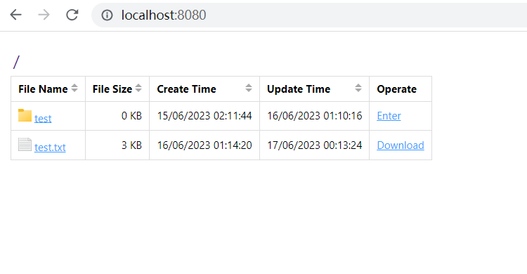
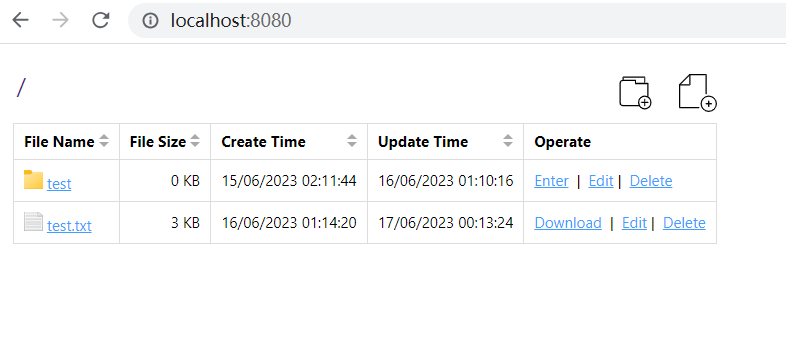

# fdw

 A simple file directory web service that can be executed in any directory

# Installation

```sh
  npm install fdw -g

  # or

  yarn global add fdw

```

# usage

### Execute in any directory
  
  ```sh
  fdw -p 8080 --writable
  ```

  > Server Running , Access the server via : http://127.0.0.1:8080

# Parameters

  ```text
  Usage: fdw <command> [options]

  Options:
    -V, --version        output the version number
    -p, --port <number>  Server port (default: 8080)
    -d, --dir <value>    The root directory (default: "./")
    -w, --writable       File directory has write permission (default: false)
    -h, --help           display help for command

  ```

# Features

Readable ( default )
- [x] display file list
- [x] sort by file attributes
- [x] download file
- [x] access subdirectory 

Writable ( --writable )
- [x] upload multiple files
- [x] create directory
- [x] modify directory name
- [x] delete file
- [x] delete directory

# Show
## Readable


## Writable


